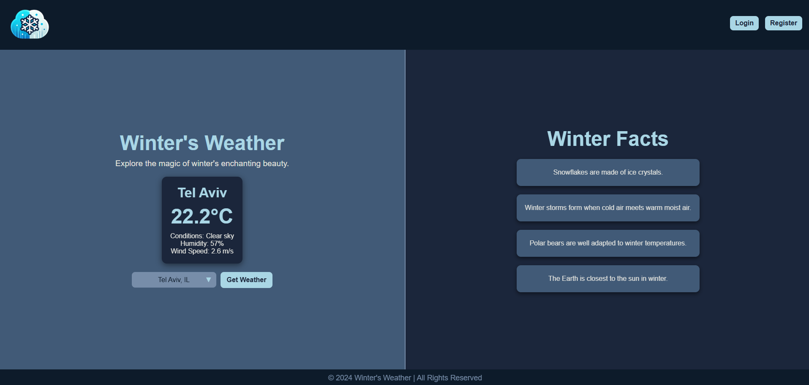
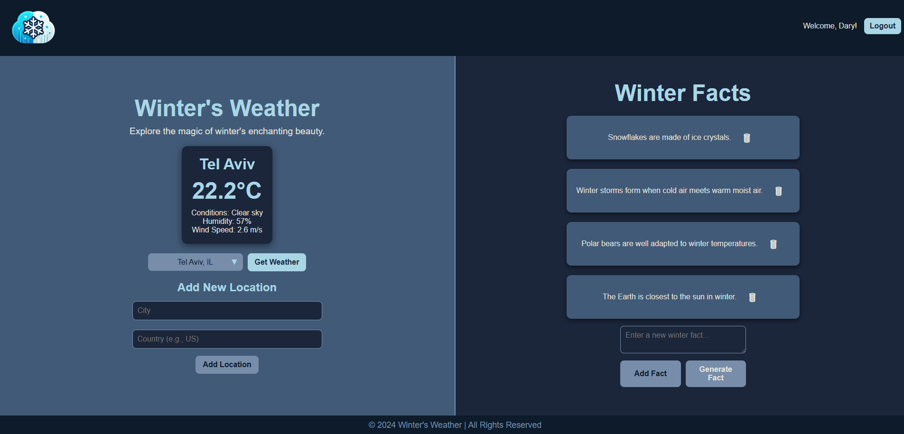

# Weather Application

This project is a **feature-rich weather application** designed to provide real-time weather forecasts and additional functionalities through an intuitive user interface. By leveraging modern DevOps practices and technologies, it ensures seamless deployment, robust scalability, and efficient monitoring.

### Key Highlights:
- **Containerized Architecture**: Built with **Docker**, ensuring consistent and portable environments across all platforms.
- **CI/CD Pipelines**: Integrated with **Jenkins** and **ArgoCD**, enabling automated testing, builds, and continuous deployments.
- **Kubernetes Orchestration**: Deployed on a Kubernetes cluster for high availability, scalability, and efficient resource management.
- **Helm Charts**: Simplifies Kubernetes configurations and deployments with parameterized Helm charts.
- **Monitoring and Visualization**: Tracks application and infrastructure performance using **Prometheus** and **Grafana**.
- **OpenAI Integration**: Generates dynamic, interesting facts to enhance the user experience.
- **MongoDB Database**: Stores and retrieves data efficiently to support application functionality.
- **Unit Testing**: Ensures application stability with pre-built test cases.
- **Shell Scripting**: Automates infrastructure setup and credential management.

This comprehensive setup ensures a reliable, scalable, and feature-packed application that runs smoothly in modern cloud-native environments.

### User Interface

Here's a glimpse of the Weather Application interface:

*Logged Out View*


*Logged In View*


---

## Features

- **Live Weather Updates**: Displays real-time weather information using external APIs.
- **Generate a Fact**: Uses OpenAI's API to generate fun or informative facts for users directly on the site.
- **Login/Register System**: Allows users to create an account or log in to access personalized features.
- **Personalized Weather Tracking**: Logged-in users can add new locations (city + country) to track weather updates.
- **Add a Fact**: Logged-in users can contribute their own facts to the system.
- **Responsive UI**: User-friendly interface built using Flask templates and static files.
- **Containerized Deployment**: Fully Dockerized for easy setup and deployment.
- **Kubernetes Ready**: Supports Kubernetes deployment for scalability and fault tolerance.
- **CI/CD Integration**: Includes a Jenkins pipeline for automated testing, building, and deployment.
- **Testing Framework**: Pre-built unit tests to ensure application stability.
- **Monitoring**: Uses Prometheus and Grafana to track performance and visualize key metrics.

---

## Tools and Technologies Used

1. **Python**:
   - Backend logic implemented in Flask (`app.py`) for handling API requests and serving HTML pages.
   - Integrates OpenAI for generating interesting facts.

3. **MongoDB**:
   - Efficiently stores and retrieves application data.

4. **Docker**:
   - `Dockerfile` for containerizing the application.
   - `docker-compose.yaml` for orchestrating multi-service deployments locally.

5. **Helm**:
   - Simplifies Kubernetes deployment with customizable charts.
   - Includes `values.yaml` for parameterized configurations and reusable templates in `templates/`.

6. **Kubernetes**:
   - Provides scalable deployment and orchestration for the application.
   - Integrated with ArgoCD for continuous deployment.

7. **Jenkins**:
   - Automates CI pipeline using the `Jenkinsfile`.

8. **ArgoCD**:
   - Enables GitOps-based continuous deployment to Kubernetes clusters.

9. **Prometheus & Grafana**:
   - Provides monitoring and visualization for application performance and infrastructure metrics.

10. **Unit Testing**:
    - Validates the application with unit tests included in `test_app.py`.

11. **Shell Scripting**:
    - Automates infrastructure setup (`infra.sh`) and obtaining passwords for jenkins+argo (`getPasswords.sh`).

---

## Installation and Setup

Setting up the Weather Application is straightforward. Follow these steps to deploy the application and its infrastructure.

### Prerequisites
Ensure the following tools are installed on your machine:
- **Python**
- **Docker**
- **Kubernetes CLI** (`kubectl`)
- **Bash**

### Steps to Install and Setup

1. **Clone the Repository**:
   Clone the project repository to your local machine:
   ```bash
   git clone https://github.com/DaryAkerman/weather-app
   cd weather-application
   ```

2. **Prepare Infrastructure**:
   - Make the `infra.sh` script executable:
     ```bash
     chmod +x infra.sh
     ```
   - Run the script to install the required infrastructure on the Kubernetes cluster:
     ```bash
     ./infra.sh
     ```
   - This will set up:
     - **Jenkins** for CI/CD pipelines.
     - **Prometheus and Grafana** for monitoring, using Helm.
     - **ArgoCD** for GitOps-based deployments.

3. **Set Up Jenkins**:
   - After the infrastructure installation, access Jenkins and create a **Multibranch Pipeline** for your repository.

4. **Configure ArgoCD**:
   - Access ArgoCD and configure the settings for your own repository.
   - Modify the `application.yaml` file to suit your setup (e.g., repository URL, branch, or path).

5. **Deploy the Application**:
   - Once the `application.yaml` file is configured, apply it to the Kubernetes cluster:
     ```bash
     kubectl apply -f application.yaml
     ```
   - This will deploy the application using ArgoCD.

---
